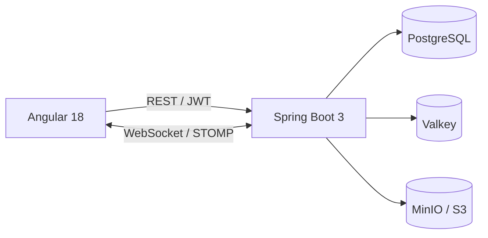

# SpaceMarine


Full-stack информационная система для управления объектами **SpaceMarine**. Проект состоит из отдельного backend на Spring Boot и frontend на Angular, поддерживает авторизацию, разграничение доступа, работу с PostgreSQL, синхронизацию изменений в реальном времени и импорт данных из файлов.

Проект развивался в три этапа: от основной информационной системы до транзакционного импорта и интеграции с S3-совместимым объектным хранилищем.

> Для просмотра наиболее полного состояния проекта: [backend `lab3`](https://github.com/andrey8080/IS_lab_backend/tree/lab3) · [frontend `lab3`](https://github.com/andrey8080/IS_lab_frontend/tree/lab3)

## Возможности

- регистрация и авторизация пользователей по JWT;
- роли пользователей и административные функции;
- CRUD-операции над SpaceMarine и связанными Chapter;
- разграничение доступа: пользователь изменяет свои объекты, администратор может работать со всеми;
- серверная валидация данных;
- фильтрация, сортировка и постраничный вывод объектов;
- специальные операции над коллекцией SpaceMarine;
- автоматическая синхронизация изменений между подключёнными клиентами через WebSocket/STOMP;
- импорт набора объектов из файла;
- история импортов;
- транзакционная обработка импорта;
- хранение файлов в MinIO / S3 на финальном этапе проекта;
- контейнеризация backend и PostgreSQL;
- CI/CD через GitHub Actions с автоматической сборкой Docker-образа и развёртыванием.

## Архитектура



Backend отвечает за бизнес-логику, безопасность, валидацию, работу с БД и импортами. Angular-клиент предоставляет интерфейсы для авторизации, просмотра и изменения объектов и получает realtime-обновления через STOMP.

## Стек

| Часть | Технологии |
| --- | --- |
| Backend | Java 17, Spring Boot 3, Spring Web, Spring Security, Spring Data JPA |
| ORM | EclipseLink |
| Auth | JWT |
| Frontend | Angular 18, Angular Material, TypeScript, RxJS |
| Realtime | Spring WebSocket, STOMP, SockJS |
| База данных | PostgreSQL |
| Cache / shared state | Valkey |
| Object Storage | MinIO, S3 API |
| Карты / визуализация | Leaflet |
| Infrastructure | Docker, Docker Compose |
| CI/CD | GitHub Actions, Docker Hub, SSH deploy |
| Build | Gradle, npm / Angular CLI |

## Структура репозитория

Основной репозиторий объединяет frontend и backend через Git submodules:

```text
space-marine/
├── IS_lab_backend/    # Spring Boot backend
├── IS_lab_frontend/   # Angular frontend
├── .gitmodules
└── readme.md
```

- [IS_lab_backend](https://github.com/andrey8080/IS_lab_backend)
- [IS_lab_frontend](https://github.com/andrey8080/IS_lab_frontend)

При клонировании репозитория используйте:

```bash
git clone --recurse-submodules https://github.com/andrey8080/space-marine.git
cd space-marine
```

Если репозиторий уже склонирован без submodules:

```bash
git submodule update --init --recursive
```

## Этапы развития

Backend и frontend имеют отдельные ветки `lab1`, `lab2`, `lab3`, соответствующие этапам проекта.

| Ветка | Что добавлено |
| --- | --- |
| `lab1` | Основная информационная система: CRUD, PostgreSQL, JWT, роли, WebSocket, работа с объектами и связанными сущностями |
| `lab2` | Массовый импорт объектов из файла, история импортов и транзакционная обработка |
| `lab3` | MinIO / S3 для файлов импорта и согласованное изменение данных между БД и объектным хранилищем; CI/CD и Docker deployment |

Для просмотра финального состояния отдельно переключите оба submodule на `lab3`:

```bash
cd IS_lab_backend
git switch lab3

cd ../IS_lab_frontend
git switch lab3
```

## Основная модель

Центральная сущность системы — `SpaceMarine`:

```text
SpaceMarine
├── id
├── name
├── coordinates
├── creationDate
├── health
├── height
├── category
├── weaponType
├── chapter
└── userName
```

Также используются связанные сущности `Coordinates`, `Chapter`, пользователи, роли и история импорта.

Категории космодесантников:

```text
SCOUT
AGGRESSOR
INCEPTOR
SUPPRESSOR
TERMINATOR
```

Типы оружия:

```text
HEAVY_BOLTGUN
BOLT_PISTOL
BOLT_RIFLE
COMBI_FLAMER
GRAV_GUN
```

## Realtime-обновления

После создания, изменения или удаления объекта backend публикует обновление через WebSocket. Подключённые Angular-клиенты получают событие без необходимости вручную перезагружать список объектов.

Для обмена сообщениями используются Spring WebSocket и STOMP/SockJS.

## Импорт данных

На втором и третьем этапах проекта реализован массовый импорт объектов из файла.

Основной endpoint:

```http
POST /file/upload
Authorization: Bearer <token>
Content-Type: multipart/form-data
```

Импорт проходит серверную валидацию. Результаты операций сохраняются в истории импортов. На финальном этапе исходные файлы также сохраняются в MinIO через S3 API.

## CI/CD

Ветка `lab3` backend содержит GitHub Actions pipeline:

```text
push в lab3
    ↓
Gradle build
    ↓
Docker build
    ↓
push образа в Docker Hub
    ↓
SSH deploy на сервер
    ↓
docker-compose up
```

Секреты для Docker Registry и удалённого сервера передаются через GitHub Actions Secrets.

## Академический контекст

Проект разработан в рамках лабораторных работ по дисциплине **«Информационные системы»** в ИТМО.

- вариант: **66672**;
- исходное задание: [se.ifmo.ru/courses/is](https://se.ifmo.ru/courses/is).

По условию требовалось создать информационную систему для управления объектами заданного класса с PostgreSQL, авторизацией, ролями, контролем владения объектами, realtime-синхронизацией и дополнительными операциями над коллекцией. В следующих лабораторных работа была расширена транзакционным импортом и объектным хранилищем.